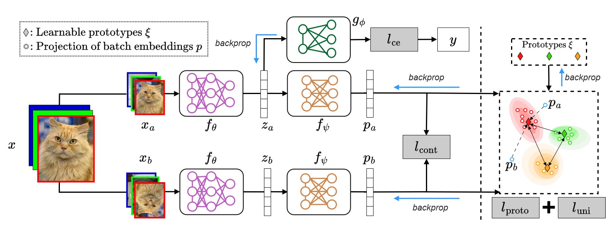
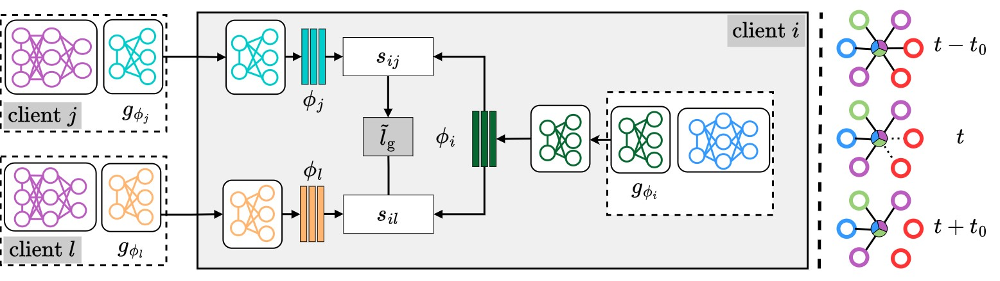

# Model Agnostic Peer-to-peer Learning (MAPL)

This is the official repository for our paper "Model Agnostic Peer-to-peer Learning"

> **Model Agnostic Peer-to-peer Learning**            
> Sayak Mukherjee, Andrea Simonetto, Hadi Jamali-Rad             
>              
>[[`arXiv`](README.md)]

## Overview
Effective collaboration among heterogeneous clients in a decentralized setting is a rather unexplored avenue in the literature. To structurally address this, we introduce Model Agnostic Peer-to-peer Learning (coined as MAPL) a novel approach to simultaneously learn heterogeneous personalized models as well as a collaboration graph through peer-to-peer communication among neighboring clients. MAPL is comprised of two main modules: (i) local-level Personalized Model Learning (PML), leveraging a combination of intra- and inter-client contrastive losses; (ii) network-wide decentralized Collaborative Graph Learning (CGL) dynamically refining collaboration weights in a privacy-preserving manner based on local task similarities. Our extensive experimentation demonstrates the efficacy of MAPL and its competitive (or, in most cases, superior) performance compared to its centralized model-agnostic counterparts without relying on any central server.

## Architecture

Owing to model heterogeneity, the local models cannot be aggregated to facilitate collaboration. We address this using PML which incorporates learnable prototypes in a local contrastive learning setting to promote learning unbiased representations.

<p align="center">

</p>

MAPL can identify relevant neighbors in a fully decentralized manner using CGL which is advantageous in two key aspects: (1) reduces the communication cost by sparsifying the collaboration graph, and (2) improves the overall performance by facilitating collaboration among clients with similar data distribution. To infer similarity without violating the data privacy,  CGL utilizes the weight vector of the locally trained classifier heads a proxy measure for client similarity. 

<p align="center">

</p>


## Installation
This code is written in `Python 3.9` and requires the packages listed in [`environment.yml`](environment.yml).

To run the code, set up a virtual environment using `conda`:

```
cd <path-to-cloned-directory>
conda env create --file environment.yml
conda activate mapl
```

## Running experiments

To run an experiment create a new configuration file in the [`configs`](configs/) directory. The experiments can be can run using the following command:

```
cd <path-to-cloned-directory>\src
python  main.py --exp_config ..\configs\<config-file-name>.json
```

We provide the configuration files for the running MAPL with heterogeneous models for scenarios 1 - 4.

## License

This project is under the MIT license.

## Remarks

Our code is partly based on the following open-source projects: [FedProto](https://github.com/yuetan031/fedproto), [FedClassAvg](https://github.com/hukla/FedClassAvg) and [Federated Learning Toolkit](https://github.com/JMGaljaard/fltk-testbed). We convey our gratitude to the developers of these resources.